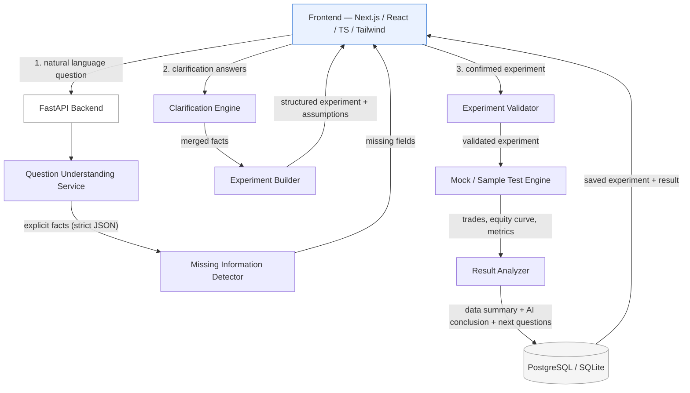

# 🧠 AI Trading Research Assistant

> A prototype AI-native trading research platform that turns a vague question into a
> structured, testable experiment — without ever silently inventing important parameters.

**Flow:** `ASK → CLARIFY → DEFINE → TEST → LEARN`

This is a **prototype**, not a production trading platform or production-grade backtesting
engine. The goal is to demonstrate honest handling of ambiguity: separating what the user said,
what the system assumed, and what the data actually shows vs. what the AI concludes.

---

## ✨ What it does

Ask something like:

> "Does buying NIFTY after a sharp fall work?"

The app will:

1. **Understand** the question — extract only what's explicitly stated (never guess).
2. **Clarify** — ask you directly for anything important that's missing (entry threshold,
   holding period, test window) instead of quietly defaulting it.
3. **Define** — build an editable, structured experiment card with all defaults clearly
   labeled as assumptions.
4. **Test** — run it against sample/simulated market data (clearly labeled as such).
5. **Learn** — show metrics, then split the output into:
   - ✅ **What the data shows** (facts)
   - 🧭 **What we can reasonably conclude** (cautious AI interpretation)
   - 🔍 **What to investigate next** (3 follow-up questions)

Everything is saved to a database and browsable in a **History** page.

---

## 🖼️ Screenshots

**CLARIFY step** — what's understood vs. what needs clarifying, before anything is assumed:

(
)

**LEARN step** — results dashboard with metrics + equity curve, clearly labeled as simulated:

(
)

---

## 🏗️ Architecture



Each stage is a single-purpose module under `backend/app/services/`, mirroring the diagram
1-to-1 — so any stage (e.g. the mock test engine) can be swapped out independently.

### AI usage principle

The app **never** depends on free-form AI text for control logic. Every AI call (question
parsing, missing-field detection, experiment building, result analysis, next-question
generation) is forced into **strict JSON** via Pydantic schemas, and the app runs fully offline
by default (`AI_PROVIDER=mock`, deterministic rule-based logic — no API key required) with a
real OpenAI structured-output path available (`AI_PROVIDER=openai`).

---

## 📂 Project Structure

```
ai-trading-research/
├── backend/                # FastAPI + SQLModel
│   ├── app/
│   │   ├── main.py
│   │   ├── config.py
│   │   ├── database.py
│   │   ├── models.py       # users, research_questions, experiments, experiment_results
│   │   ├── schemas.py
│   │   ├── services/       # one file per pipeline stage + AI prompt templates
│   │   └── routers/
│   ├── requirements.txt
│   └── .env.example
├── frontend/                # Next.js + TypeScript + Tailwind
│   ├── app/                 # ASK→CLARIFY→DEFINE→TEST→LEARN page, /history, /experiments/[id]
│   ├── components/
│   ├── lib/
│   └── .env.example
├── data/                     # synthetic sample OHLC data (NIFTY/BANKNIFTY/SENSEX)
├── docs/screenshots/         # frontend screenshots used in this README
├── README.md
├── THINKING_NOTE.md
├── AI_USAGE_NOTE.md
└── .env.example
```

---

## 🚀 Quick Start

### 1. Backend

```bash
cd backend
cp .env.example .env        # defaults work out of the box (SQLite + mock AI)
pip install -r requirements.txt
uvicorn app.main:app --reload --port 8000
```

Backend: `http://localhost:8000` · Interactive API docs: `http://localhost:8000/docs`

> **Python version note:** if you're on a very new Python release (3.13/3.14) and pandas/numpy
> try to compile from source, see the note inside `backend/requirements.txt` — leaving them
> unpinned lets pip pull versions with prebuilt wheels.

### 2. Frontend

```bash
cd frontend
cp .env.example .env.local   # NEXT_PUBLIC_API_BASE=http://localhost:8000
npm install
npm run dev
```

Frontend: `http://localhost:3000`

---

## 🔌 API Endpoints

| Method | Path | Purpose |
|---|---|---|
| `POST` | `/api/research/analyze` | Parse a question, detect missing fields |
| `POST` | `/api/research/clarify` | Merge user clarification answers into facts |
| `POST` | `/api/research/experiments` | Validate + create a structured experiment |
| `POST` | `/api/research/experiments/{id}/test` | Run the mock backtest, save results |
| `GET` | `/api/research/experiments/{id}` | Fetch an experiment definition |
| `GET` | `/api/research/experiments/{id}/result` | Fetch saved results |
| `GET` | `/api/research/history` | List all experiments + key metrics |

---

## 🗄️ Database Schema

| Table | Purpose |
|---|---|
| `users` | Placeholder for auth (single demo user assumed) |
| `research_questions` | Raw question, parsed facts (JSON), missing fields (JSON), status |
| `experiments` | Structured, validated experiment definition (FK → research_questions) |
| `experiment_results` | Metrics, equity curve, trade log, AI analysis, next questions (FK → experiments) |

Defaults to **SQLite** (`sqlite:///./trading_research.db`) so it runs with zero setup. Point
`DATABASE_URL` at a Postgres instance for a closer-to-production setup — see
`backend/.env.example`.

---

## ⚙️ Environment Variables

Never commit real `.env` files — only the `.env.example` templates are tracked (see
`.gitignore`).

**`backend/.env`**

| Variable | Description | Default |
|---|---|---|
| `DATABASE_URL` | Postgres or SQLite connection string | `sqlite:///./trading_research.db` |
| `AI_PROVIDER` | `mock` (offline, deterministic) or `openai` | `mock` |
| `OPENAI_API_KEY` | Required only if `AI_PROVIDER=openai` | — |
| `OPENAI_MODEL` | OpenAI model name | `gpt-4o-mini` |
| `FRONTEND_ORIGIN` | CORS allowlist origin | `http://localhost:3000` |

**`frontend/.env.local`**

| Variable | Description | Default |
|---|---|---|
| `NEXT_PUBLIC_API_BASE` | Backend base URL | `http://localhost:8000` |

---

## ⚠️ Known Risks & Limitations

- **Ambiguous definitions** — "sharp fall" has no universal threshold; results are threshold-dependent.
- **Assumption risk** — default holding period / cost / slippage are estimates, not ground truth.
- **Data quality** — sample data is **synthetic**, not real market history.
- **Look-ahead bias, transaction costs, slippage, overfitting** — all real research risks not fully solved by this simplified engine.
- **Insufficient evidence** — small trade counts are explicitly flagged, never treated as statistically conclusive.
- Not a production backtester: single-position, non-overlapping trades, no order-book realism.

See `THINKING_NOTE.md` for the full reasoning behind these tradeoffs.

### What would be improved with more time
- Real, vetted historical market data instead of synthetic data.
- Realistic order execution, position sizing, and portfolio-level backtesting.
- Authentication / multi-user support.
- Automated parameter-sensitivity sweeps for the "next questions" the AI suggests.
- Test coverage for each service module and API endpoint.

---

## 📄 Docs

- [`THINKING_NOTE.md`](./THINKING_NOTE.md) — how ambiguity, assumptions, and experiment design were reasoned through.
- [`AI_USAGE_NOTE.md`](./AI_USAGE_NOTE.md) — how AI tools were used to build this project.

---

## 📜 License / Disclaimer

Prototype for research and educational purposes only. Results are based on simulated/sample
data and do **not** constitute financial advice or a guarantee of future performance.
